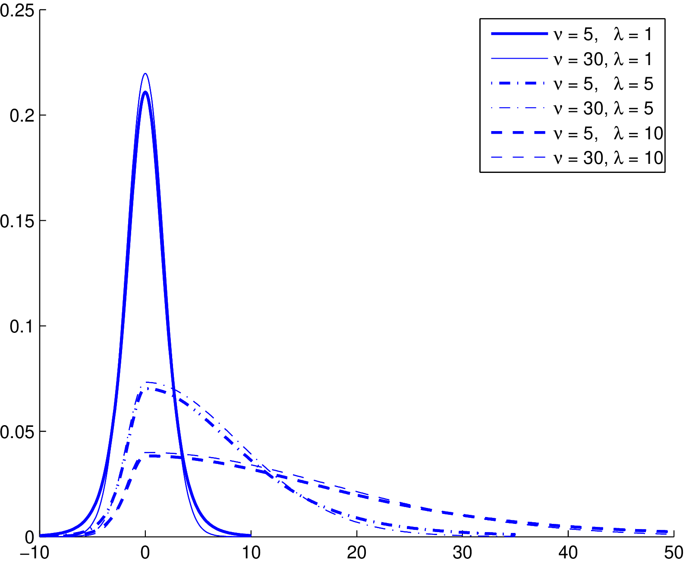

# dng 

<!-- badges: start -->

[](https://github.com/feng-li/dng/actions)
[](https://CRAN.R-project.org/package=dng)

<!-- badges: end -->

`dng` provides distribution and gradient functions for split-normal and
split-t distributions. It includes density, distribution, quantile, random
generation, moment, and analytical gradient routines implemented with Rcpp.

## Installation

Install the CRAN release with:

```r
install.packages("dng")
```

Install the development version from GitHub with:

```r
remotes::install_github("feng-li/dng")
```

## Split-Normal Distribution

```r
library(dng)

n <- 3
mu <- c(0, 1, 2)
sigma <- c(1, 2, 3)
lmd <- c(1, 2, 3)

x <- rsplitn(n, mu, sigma, lmd)
d <- dsplitn(x, mu, sigma, lmd, logarithm = FALSE)
p <- psplitn(x, mu, sigma, lmd)
q <- qsplitn(p, mu, sigma, lmd)

all.equal(x, q)
```

Moment helpers are also available:

```r
splitn_mean(mu, sigma, lmd)
splitn_var(sigma, lmd)
splitn_skewness(sigma, lmd)
splitn_kurtosis(lmd)
```

Gradients of the CDF and log-density are available through `gsplitn()`:

```r
gsplitn(
  x,
  list(mu = mu, sigma = sigma, lmd = lmd),
  parCaller = "mu",
  denscaller = c("u", "d")
)
```

## Split-t Distribution

```r
mu <- c(0, 1, 2)
df <- rep(10, 3)
phi <- c(0.5, 1, 2)
lmd <- c(1, 2, 3)

x <- rsplitt(n, mu, df, phi, lmd)
d <- dsplitt(x, mu, df, phi, lmd, logarithm = FALSE)
p <- psplitt(x, mu, df, phi, lmd)
q <- qsplitt(p, mu, df, phi, lmd)

all.equal(x, q)
```

Moment helpers are also available:

```r
splitt_mean(mu, df, phi, lmd)
splitt_var(df, phi, lmd)
splitt_skewness(df, phi, lmd)
splitt_kurtosis(df, phi, lmd)
```

Gradients of the CDF and log-density are available through `gsplitt()`:

```r
gsplitt(
  x,
  list(mu = mu, df = df, phi = phi, lmd = lmd),
  parCaller = "mu",
  denscaller = c("u", "d")
)
```

## Reference

Li, F., Villani, M., and Kohn, R. (2010). Flexible modeling of conditional
distributions using smooth mixtures of asymmetric student t densities.
*Journal of Statistical Planning and Inference*, 140(12), 3638-3654.
<https://doi.org/10.1016/j.jspi.2010.04.031>

## License

GPL (>= 2)
